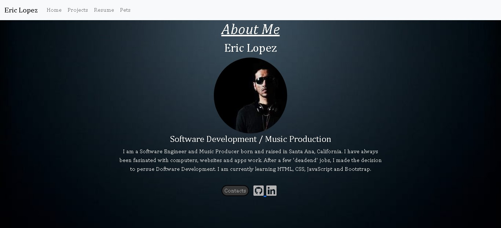

# Eric Lopez's Portfolio (Project 1)

Installation Instructions
-------------

- Fork and clone this reository
- Open 'index.html' file in your editor

Technologies used
------------

I used HTML, CSS, JavaScript, Bootstrap, Github and Visual Studio Code

User Stories
----------

As Eric's family, We want to see what he is doing and what he has learned so we can better understand what he is working towards.

Wireframe
---------

I used [moqups.com](https://moqups.com/) to make my wireframe.  Although it was very helpful, there were some aspects of my website's design that changed.  A lot of the elements are still present however.

[Home (desktop)](wireframe/home_desktop.jpg)
[Projects (desktop)](wireframe/projects_desktop.jpg)
[Resume (desktop)](wireframe/resume_desktop.jpg)
[Mobile view](wireframe/home_mobile.jpg)